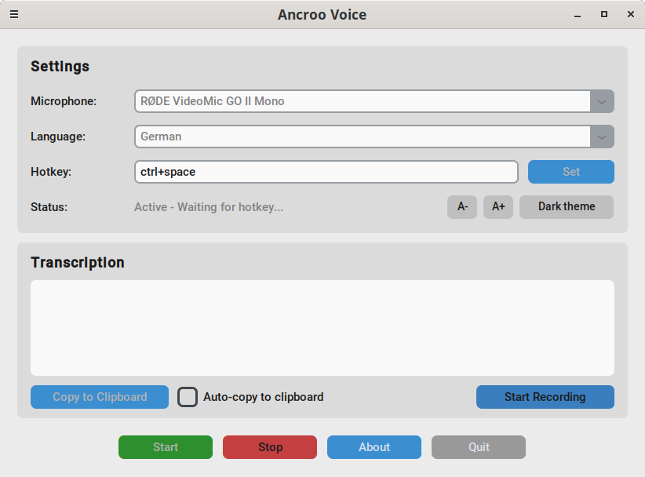
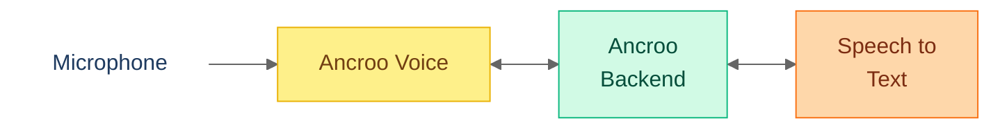

#  Ancroo Voice — STT Client for Ancroo Stack

[](LICENSE)
[](https://www.python.org/)
[](https://github.com/TomSchimansky/CustomTkinter)
[]()

Push-to-talk speech-to-text client for the [Ancroo Stack](https://github.com/ancroo/ancroo-stack). Hold a hotkey, speak, release - text appears at your cursor.

Transcription is managed centrally by the Ancroo Backend — the client just sends audio. Lightweight binary for Linux and Windows, no local GPU required.

> **Phase 0 (Beta)** — Ancroo Voice works end-to-end, but the backend it connects to runs without encryption or authentication by default. Intended for local/trusted networks only. See the [Ancroo Roadmap](https://github.com/ancroo/ancroo/blob/main/ROADMAP.md) for the security path forward.



## How It Works



## Features

- **Push-to-Talk**: Hold hotkey to record, release to transcribe
- **Backend-Managed STT**: Ancroo Backend handles model and server selection centrally
- **Lightweight Binary**: Small download, no GPU dependencies
- **Linux + Windows**: Pre-built binaries for both platforms
- **Configurable Hotkeys**: Any key combination (Ctrl+Space, Alt+R, etc.) with visual hotkey recorder
- **Multi-Language**: 10 languages + Auto-Detection
- **Dark/Light Mode**: Switch between dark and light themes
- **UI Scaling**: Adjustable font size (A-/A+ buttons)
- **Auto-Copy**: Optionally copy transcriptions to clipboard automatically
- **GUI Record Button**: On-screen record button as alternative to hotkeys (required on Wayland)

> **Tip:** Pair Ancroo Voice with a Stream Deck or foot pedals for one-button dictation and workflow triggers. You can see an example setup in this Article: [Supercharge Your AI Workflow: Speech-to-Text with Stream Deck](https://medium.com/@stefanschmidbauer/supercharge-your-ai-workflow-speech-to-text-with-stream-deck-6ac5fd427894)

## Download

Download the latest release for your platform:

| Platform    | Download                                                                                       |
| ----------- | ---------------------------------------------------------------------------------------------- |
| **Windows** | [AncrooVoice-Windows.zip](https://github.com/ancroo/ancroo-voice/releases/latest)  |
| **Linux**   | [AncrooVoice-Linux.tar.gz](https://github.com/ancroo/ancroo-voice/releases/latest) |

## Quick Start

### 1. Extract & Run

**Windows:**

```
1. Extract ZIP
2. Run AncrooVoice.exe
```

> **Note:** Windows may show an "Unknown publisher" warning. Click **"More info"** → **"Run anyway"**.

**Linux:**

```bash
tar -xzf AncrooVoice-Linux.tar.gz
./AncrooVoice-Linux.sh
```

> **Wayland:** Global hotkeys are not supported on Wayland due to security restrictions. Use the on-screen record button instead.

### 2. Configure Backend Connection

Edit the config file to point to your Ancroo Backend (`.env` on Linux, `ancroo-voice.ini` on Windows):

```ini
ANCROO_BACKEND_ENDPOINT=http://your-server:8900/api/v1/transcribe
```

> **Important:** The Ancroo Backend must have at least one active STT provider configured. Use the Admin UI at `http://your-server:8900/admin/stt-providers` to register your STT server (e.g. Whisper-ROCm, Speaches).

### 3. Use

1. Select microphone
2. Click "Start"
3. Hold your hotkey (default: Ctrl+Space) and speak
4. Release - text appears at cursor

## Provider

Ancroo Voice connects to the **Ancroo Backend**, which manages STT model and server selection centrally. The client sends audio and receives transcribed text — no local configuration of STT models needed.

## Configuration

| Variable                    | Required | Description                                                            |
| --------------------------- | -------- | ---------------------------------------------------------------------- |
| `ANCROO_BACKEND_ENDPOINT`   | Yes      | Ancroo Backend transcribe URL, e.g. `http://your-server:8900/api/v1/transcribe` |
| `ANCROO_BACKEND_API_KEY`    | No       | Bearer token for authenticated backends                                |
| `ANCROO_BACKEND_VERIFY_SSL` | No       | Set to `false` for self-signed certificates                            |

> **Note:** The endpoint points to the **Ancroo Backend** (default port 8900), not directly to a Whisper/STT server. The backend handles model and server routing internally.

## File Locations

| File                        | Purpose            | Notes                              |
| --------------------------- | ------------------ | ---------------------------------- |
| `.env` / `ancroo-voice.ini` | Backend connection | `.env` on Linux, `.ini` on Windows |
| `ancroo-voice_config.json`  | GUI settings       | Auto-saved by the application      |

## Acknowledgments

This project is built with the following open-source software:

| Project | Purpose | License |
|---------|---------|---------|
| [CustomTkinter](https://github.com/TomSchimansky/CustomTkinter) | GUI framework | MIT |
| [pynput](https://github.com/moses-palmer/pynput) | Global hotkey listener | LGPL-3.0 |
| [sounddevice](https://github.com/spatialaudio/python-sounddevice) | Audio recording | MIT |
| [NumPy](https://numpy.org/) | Audio processing | BSD-3-Clause |
| [Pillow](https://python-pillow.org/) | Image handling | HPND |
| [Requests](https://requests.readthedocs.io/) | HTTP client | Apache-2.0 |

Speech-to-text is provided by [OpenAI Whisper](https://github.com/openai/whisper) (MIT) models running on your server via the [Ancroo Stack](https://github.com/ancroo/ancroo-stack).

## License

MIT — see [LICENSE](LICENSE). The Ancroo name is not covered by this license and remains the property of the author.

## Author

**Stefan Schmidbauer** — [GitHub](https://github.com/Stefan-Schmidbauer) · [stefan@ancroo.com](mailto:stefan@ancroo.com)

---

Built with the help of AI ([Claude](https://claude.ai) by Anthropic).
